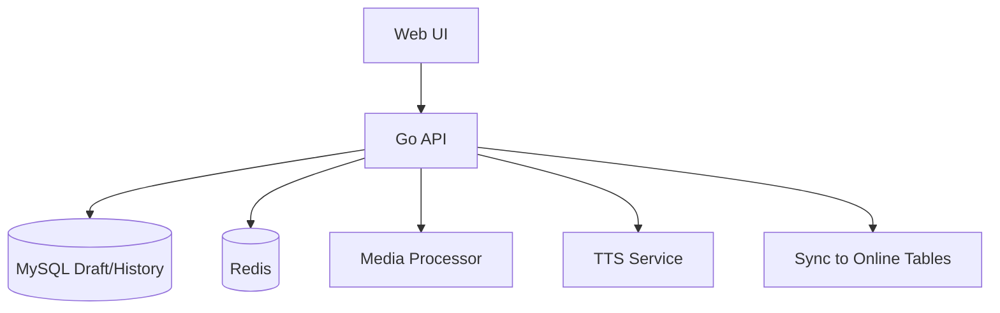

# 变更提案: app-ui-plan-system

## 元信息
```yaml
类型: 新功能
方案类型: implementation
优先级: P0
状态: 草稿
创建: 2026-01-26
```

---

## 1. 需求

### 背景
线上已有 App 后端服务，但新增景区上线时依赖多人在文档中协作填写与上传媒体，容易出错且协作混乱。媒体文件缺少统一的尺寸、大小与格式限制，也缺少可追溯的操作历史。

### 目标
- 提供 PC 端“数枢-APP景区UI方案系统”，支持景区版本信息与 UI 资产的结构化录入
- 管理员可分配任务给多人，任务对所有人可见，允许协作补充并完整记录历史
- 全量数据先写入临时表，确认后同步到线上正式表
- 媒体文件必须按规则校验与压缩，可配置规则
- 支持本地草稿、提交/二次确认、差异对比与审计追溯
- 集成 TTS 服务，生成场景语音文案与音频

### 约束条件
```yaml
时间约束: 未指定
性能约束: 大文件上传需稳定，媒体处理需可控且可追溯
兼容性约束: PC 端，现代浏览器；后端 Go，数据库 MySQL，缓存 Redis
业务约束: 仅管理员/普通用户两类角色；所有字段可空，最终同步需遵守原表非空约束
```

### 验收标准
- [ ] 管理员可创建景区版本并分配任务，普通用户可领取/协助完成
- [ ] 覆盖 banners/identities/scenes/app_ui_fields/config_extra_steps/clothes_categories/photo_hobbies/视频等录入
- [ ] 本地草稿可保存与恢复，提交流程支持二次确认与差异展示
- [ ] 所有操作有字段级 + 文件版本级历史记录
- [ ] 媒体规则可配置并生效，图片/视频校验与压缩可用
- [ ] 支持 TTS 文案生成与音频输出
- [ ] 一键同步到线上表并通过非空字段校验

---

## 2. 方案

### 技术方案
- 前端: Vite + React + Antd + TypeScript，模块化表单与媒体管理
- 后端: Go API（建议 Gin），MySQL 作为临时表与历史表存储，Redis 用于任务锁/状态缓存
- 临时表策略: 为所有涉及线上表建立对应的 draft_ 前缀临时表，允许字段为空；同步时按线上表约束校验
- 提交与二次确认: 每次提交形成快照，若提交人变化则生成差异对比，确认后写入“最终确认”版本
- 媒体处理: 后端统一进行校验与压缩（图片与视频），前端仅做预校验与预览；上传使用 OSS 预签名直传，数据库仅存储 path
- TTS: 复用 `/Users/liunian/web_project/shushu-tts` 的接口与逻辑

### 影响范围
```yaml
涉及模块:
  - web: 表单录入、任务协作、差异对比、媒体工具
  - server: API、媒体处理、TTS、同步流程、历史审计
  - db: 临时表、历史表、媒体规则表
  - ops: 媒体处理依赖（如 ffmpeg）
预计变更文件: 新项目初始化，文件数量依脚手架而定
```

### 风险评估
| 风险 | 等级 | 应对 |
|------|------|------|
| 媒体处理依赖（ffmpeg）不可用 | 中 | 预置依赖检查与降级策略 |
| 线上表字段约束未知 | 中 | 先读取表结构并生成校验策略 |
| TTS 复用接口变动 | 低 | 封装适配层并增加集成测试 |
| 协作提交差异冲突 | 中 | 引入提交版本与锁机制 |

---

## 3. 技术设计（可选）

> 涉及架构变更、API设计、数据模型变更时填写

### 架构设计


### API设计
#### POST /api/draft/versions
- **请求**: {"scenic_name":"博物馆","version_name":"BOWUGUAN","ai_model":"SD"}
- **响应**: {"id":123,"status":"draft"}

#### POST /api/submit/{module}/{id}
- **请求**: {"payload":{...},"submit_comment":"..."}
- **响应**: {"need_confirm":true,"diff":{...}}

#### POST /api/sync/{version_id}
- **请求**: {"confirm":true}
- **响应**: {"status":"synced","errors":[]}

### 数据模型
| 字段 | 类型 | 说明 |
|------|------|------|
| draft_id | bigint | 临时记录主键 |
| version_id | bigint | 关联景区版本 |
| payload_json | json | 提交快照 |
| submit_by | bigint | 提交人 |
| submit_version | int | 提交版本号 |
| status | varchar | draft/submitted/confirmed |

---

## 4. 核心场景

### 场景: 管理员创建版本并分配任务
**模块**: 版本管理/任务管理
**条件**: 管理员登录
**行为**: 创建“博物馆”版本 → 自动生成版本名 → 分配轮播图/场景/身份等任务给多人
**结果**: 任务列表生成，相关人员可见并开始录入

### 场景: 普通用户录入场景并提交
**模块**: 场景录入/媒体处理
**条件**: 任务已分配或可协作
**行为**: 上传场景图片与语音文案 → 本地草稿保存 → 提交
**结果**: 生成提交快照与操作历史，待确认

### 场景: 协作提交触发差异对比
**模块**: 提交与确认
**条件**: 上次提交人 ≠ 本次提交人
**行为**: 展示两次提交差异 → 任意用户确认
**结果**: 形成最终确认版本，可进入同步流程

---

## 5. 技术决策

### app-ui-plan-system#D001: 媒体处理位置选择
**日期**: 2026-01-26
**状态**: ✅采纳
**背景**: 需要保证图片/视频尺寸与大小规则稳定一致
**选项分析**:
| 选项 | 优点 | 缺点 |
|------|------|------|
| A: 前端处理 | 体验快 | 浏览器差异大、视频处理不稳定 |
| B: 后端统一处理 | 一致性强、便于审计 | 后端实现量增加 |
| C: 异步处理服务 | 可扩展 | 架构复杂度高 |
**决策**: 选择方案B
**理由**: 需要强一致性与可追溯性
**影响**: server/media, web/upload

### app-ui-plan-system#D002: 历史记录粒度
**日期**: 2026-01-26
**状态**: ✅采纳
**背景**: 需求希望“越详尽越好”的历史记录
**选项分析**:
| 选项 | 优点 | 缺点 |
|------|------|------|
| A: 实体级 | 实现简单 | 追溯粒度不足 |
| B: 字段级 | 可精确追溯 | 数据量增加 |
| C: 字段级 + 文件版本 | 可追溯到媒体处理 | 实现复杂 |
**决策**: 选择方案C
**理由**: 满足协作审计与差异对比需要
**影响**: db/history, server/audit, web/diff

### app-ui-plan-system#D003: 临时表与同步策略
**日期**: 2026-01-26
**状态**: ✅采纳
**背景**: 需要在确认后再同步到线上表
**选项分析**:
| 选项 | 优点 | 缺点 |
|------|------|------|
| A: 直接写线上表 | 简单 | 风险高，不可回溯 |
| B: 临时表 + 同步 | 可控、可回滚 | 需要额外表结构 |
**决策**: 选择方案B
**理由**: 符合需求，支持确认与审计
**影响**: db/draft, server/sync
